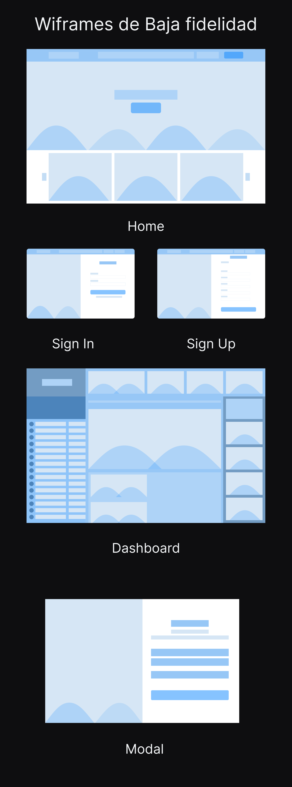

# E3-BEDU

## Proyecto Final de Módulo Django

### Introducción:
El E3 es un evento que se realizaba de formar presencial con anterioridad. Al llegar la pandemia, tuvo que ser cancelado como muchos eventos. 

### Objetivo:
Diseñar un witio web en el que pueda realizarse el evento. Al intercambiar el modo de presencial a en línea, se busca de alguna manera, seguir teniendo esa interacción con los usuarios.

### Arquitectura del proyecto

* Diseño de Interfaz a realizar
* Proyecto realizado con Django
* Docker y Postgresql para la bade de datos

### Desarrollo

<section>
  <h3>1. Diseño de Interfaz a realizar</h3>
  
A partir de la investigación, obtuvimos para la arquitectura de nuestro sitio el siguiente esquema:

  <ul>
    <li>Home</li>
    <li>Login</li>
    <li>Dashboard</li>
    <li>Stands</li>
    <li>Articulos</li>
  </ul>

  
Se diseñador wireframes de baja fidelidad donde se realizaba los procesos que se habian tenido de la investigación:

  

</section>

<section id="backend">
  <h3>2. Desarrollo de Backend con Node.js y API Rest con Express.js</h3>
  
Se trabajo todo lo aprendido en clase para levantar un servidor donde se estructuró una API rest para la pastelería.

  
Se empezo trabajando con las principales routas que tendriamos para la aplicación. Se mantuvo la ideología de una Clean Architecture al crear una capa de servicios de cada uno de nuestros enpoints.

  
Despues se incorporaron middlawares para espuesta de servidor, así como para validar los datos de entrada.

  
Se incorporo un ORM para el manejo de la base de datos y se levanto un contenedor en PostgreSQL y de pgAdmin

   
</section>
  
<section id="one">
  <h3>3. Base de datos con PostgreSQL.</h3>  
  
Teniendo ya las rutas para las peticiones de datos, se trabajo en el ORM para diseñar las tablas donde estarian nuestros datos.

  
Se diseñaron las siguientes tablas:

   
</section>

 
<section id="frontend">
  <h3>5. Diseño Frontend de la aplicación web.</h3>  
  
Se empezo la maquetación de la página web del diseño de WireFrames de alta fidelidad. Se trabajarón cada uno de los eventos que realizaría la página y los botones, y despues se trabajo con el DOM para pintar cada petición.

   
  
</section>
