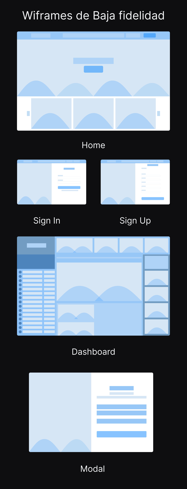
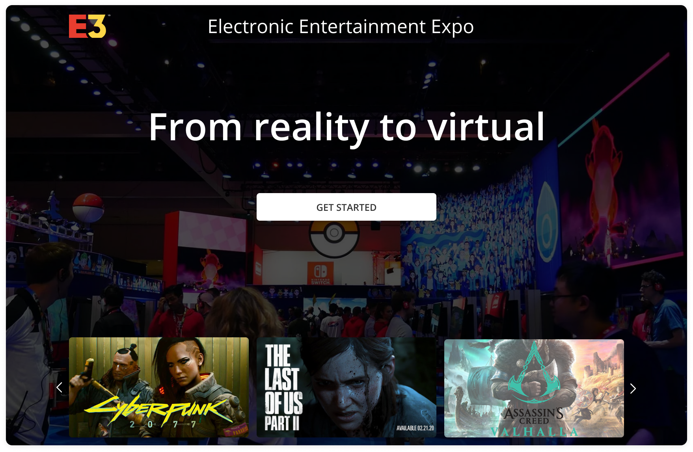
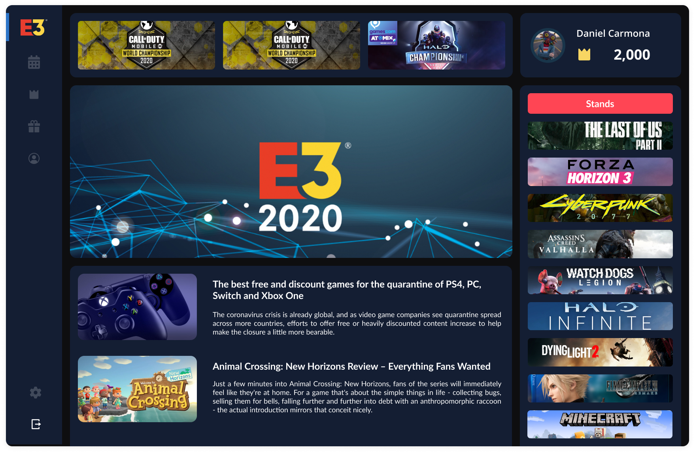
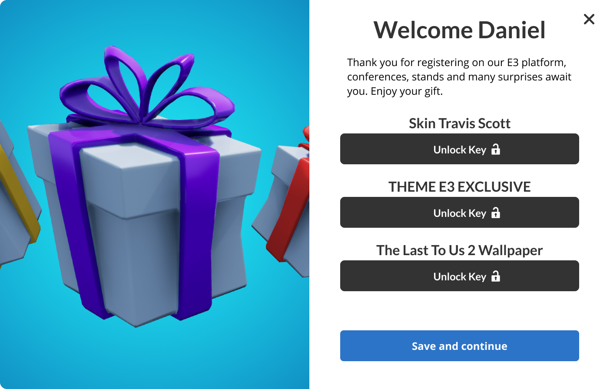

# E3-BEDU

## Proyecto Final de Módulo Django
   
### Introducción:
El E3 es un evento que se realizaba de forma presencial con anterioridad. Al llegar la pandemia, tuvo que ser cancelado como muchos eventos. 

### Objetivo:
Diseñar un sitio web en el que pueda realizarse el evento. Al intercambiar el modo presencial a en línea, se busca de alguna manera, seguir teniendo esa interacción con los usuarios.

### Arquitectura del proyecto

* Diseño de Interfaz a realizar
* Proyecto realizado con Django
* Docker y Postgresql para la base de datos

<section>
  <h3>1. Diseño de Interfaz a realizar</h3>
  
  
A partir de la investigación, obtuvimos para la arquitectura de nuestro sitio el siguiente esquema:

  <ul>
    <li>Home</li>
    <li>Login</li>
    <li>Dashboard</li>
    <li>Stands</li>
    <li>Articulos</li>
  </ul>

  
Se diseñaron wireframes de baja fidelidad donde se plasmaba los procesos que se habían obtenido de la investigación:

  

  <h4>Diseños de alta fidelidad</h4>
  
Se empezo todo el proceso de diseño donde a partir de un moodboard y un style guide, se trabajó en los prototipos de alta fidelidad

  
  
  
  
  
  

</section>

<section id="backend">
  <h3>2. Proyecto realizado con Django</h3>

  
Se empezo levantando el proyecto de Cokiecutter Django

  
Para hacer el inicio de sesión y registro trabajamos con las loginview

  
Se realizaron 4 apps dentro del proyecto

  
   

</section>
  
<section id="backend">
  <h3>3. Docker y Postgresql para la base de datos</h3>

  
Se trabajo con instancias de Docker para ejecutar Postgresql

  
Se trabajaron 3 modelos

  
   

</section>

